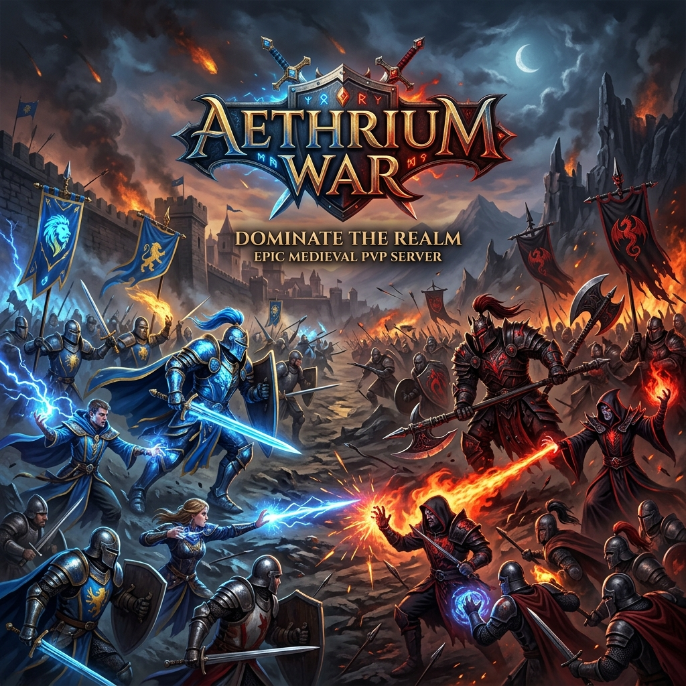

# 🛡️ Aethrium War — Ultimate 8.60 PvP Arcade

O **Aethrium War** é um servidor de guerra (**War Server**) de alta performance, focado em recriar a era de ouro do combate competitivo do **Tibia 8.60**. Com um motor customizado em **C++ (TFS 1.x Fork)** e uma lógica de scripts otimizada para combates massivos, oferecemos uma experiência equilibrada, frenética e totalmente focada em habilidade.

---

## ⚔️ Mecânicas Core (Arcade Style)

Esqueça o "farme" e a progressão lenta. O Aethrium War é um ambiente **Arcade Dinâmico** onde a burocracia do MMORPG dá lugar ao combate de arena puro.

- **Dynamic Level 250 Engine**: Nivelamento imediato para todos os jogadores. O servidor recalcula HP, Mana e Cap em tempo real, sem dependência de banco de dados.
- **Instant Respawn (Anti-Death Popup)**: Morreu? Você é teleportado imediatamente para a base, curado e com status resetados. Sem janelas de "You are Dead", sem perda de itens.
- **Pure 8.60 Physics**: Velocidade base cravada nas fórmulas originais (`110 + Level`), exaustão de magias e janelas de runas calibradas para o meta clássico.
- **Guild Team Visual**: Cores e Outfits forçados por time (Team Antica, Nova, Secura), garantindo clareza tática no meio do caos de batalhas massivas.

---

## 🛠️ Stack Técnica

Utilizamos o estado da arte do ecossistema **Open Tibia**:

- **Engine**: The Forgotten Server 1.x (Customized Fork)
- **Protocolo**: 8.60 (Classic Meta)
- **Client**: OTClient Redemption (4.0+)
- **Map System**: Rotação dinâmica de arenas baseada em Rounds e Frags.
- **Sync**: Sistema de login instantâneo (Manager) e proteção de base via scripts nativos.

---

## 🗺️ Roadmap de Desenvolvimento

Acompanhe o estado atual das funcionalidades:

- **[X] Motor de Reset Dynamic 250 (Lua In-Memory)**: Substituição de Snapshots SQL por matemática rápida O(1).
- **[X] Sincronização de Protocolo 8.6**: Ajustes estritos de rede para o Redemption Client.
- **[X] Sistema de Addons & Outfits Free**: Desbloqueio automático de todos os addons 8.60.
- **[ ] Global Frag Display**: Interface visual no client para exibir o placar da war em tempo real.
- **[ ] Map Pack World War**: Arenas lendárias (Thais, Edron, Venore) totalmente adaptadas.

---

## 📸 Comunidade & Contato

Faça parte da história do Aethrium e acompanhe os updates diários:

👉 **[Instagram - Tibia Old Schools](https://instagram.com/tibiaoldschools/)**

---

### 🏛️ Créditos
*Desenvolvido por **[@iflcosta](https://www.instagram.com/iflcosta/)** para a comunidade **Open Tibia**. Um tributo aos grandes World Wars que definiram a história do Tibia.*
